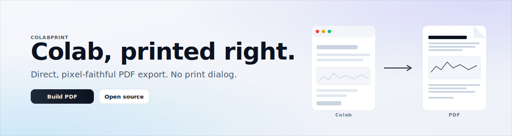

<p align="center">
  
</p>

# ColabPrint

<p align="left">
  
  
  
  <a href="https://github.com/ammaar-alam/colab-print/actions/workflows/check.yml"></a>
</p>

> Direct, visually faithful PDF export for Google Colab. No print dialog. No manual "expand all". No truncated cells.

ColabPrint is a Manifest V3 Chromium extension that turns a Google Colab notebook into a clean, paginated PDF — the way it actually looks on screen. The browser print path mangles notebooks: it clips long outputs, breaks sandboxed iframes, injects header bars, and leaves white margins on dark themes. ColabPrint skips that path entirely. It captures the notebook as rendered pixels, scrolls through the whole document, and composes a PDF page by page.

## Why it exists

If you've ever tried to submit a Colab notebook as a PDF — for a class, a lab report, or a write-up — you've seen the usual problems:

- `File → Print → Save as PDF` truncates the notebook at the viewport
- Charts and Plotly widgets disappear or render half-rendered
- Sandboxed iframes (ipywidgets, interactive outputs) export as empty boxes
- Dark theme notebooks print with garish white margins
- Long outputs get sliced down the middle of a code cell

ColabPrint solves this the dumb, reliable way: it takes the notebook as pixels, which is what you actually want to hand in.

## Features

- **Direct PDF output.** The browser print dialog is not part of the export path.
- **Full-notebook capture.** Auto-scrolls the entire notebook, not just the viewport.
- **Pixel-faithful.** Plots, rich HTML, tables, images, and iframe outputs all export as they render.
- **Theme-aware.** Page margins follow the notebook's own background, so dark notebooks don't get white borders.
- **A4 or US Letter.** Sensible default margins, no extra chrome.
- **Zero runtime dependencies.** Pure Manifest V3 + vanilla JS. No bundler. No build step.
- **Minimal permissions.** `activeTab` and `scripting`. Nothing else.
- **Buildless.** Clone, load unpacked, ship.

## Install

ColabPrint is unpacked-friendly and works in any Chromium browser (Chrome, Arc, Brave, Edge, Vivaldi).

1. Clone or download this repository:
   ```bash
   git clone https://github.com/ammaar-alam/colab-print.git
   ```
2. Open `chrome://extensions` (or the equivalent in your browser).
3. Enable **Developer Mode**.
4. Click **Load unpacked** and select the cloned `colab-print` directory.
5. Pin **ColabPrint** to the toolbar.

Chrome Web Store listing is planned.

## Usage

1. Open a Google Colab notebook.
2. Click the ColabPrint toolbar icon.
3. Pick A4 or US Letter.
4. Click **Build PDF**.
5. Keep the notebook tab active while capture runs (it needs to scroll the page).
6. A new tab opens with your finished PDF ready to download.

Capture takes a few seconds for short notebooks; longer ones can take up to a minute.

## How it works

```
popup ──▶ service worker ──▶ content script prepares the tab
                              │
                              ▼
           ┌─────────────────────────────────┐
           │ scroll → capture → crop → store │
           └─────────────────────────────────┘
                              │
                              ▼
                          export page
                  (composes paginated PDF
                   directly, no print path)
```

1. The popup detects the active Colab tab and hands a job to the service worker.
2. The content script hides Colab chrome (toolbars, tooltips, cell controls) so the capture is clean.
3. The service worker walks the notebook scroll container in measured steps, capturing each frame with `tabs.captureVisibleTab()`.
4. Frames are cropped to the notebook viewport and stored in IndexedDB.
5. The export page paginates the captured slices into a PDF, writes the PDF bytes directly (`buildPdfDocument` in `src/shared/pdf-writer.js`), and offers a download and preview.

The resulting PDF is image-based. That's a deliberate tradeoff: it reliably preserves charts, widgets, and iframe outputs that the semantic print path routinely butchers.

## Known limits

- The notebook tab must stay active during capture (it's how the browser lets extensions see the page).
- The exported PDF reflects whatever is currently rendered — collapsed cells stay collapsed, lazy outputs stay lazy. Expand anything you want in the export before clicking **Build PDF**.
- PDFs are image-backed, so text isn't selectable. If you need a semantic text layer, the current browser print path is still technically your option — this extension is for the cases where that path fails.
- Very long notebooks produce correspondingly large files.

## Repository layout

```
.
├── assets/              # extension icons
├── docs/                # README artwork and screenshot notes
├── manifest.json
├── package.json         # no runtime deps; scripts only
└── src/
    ├── background/      # MV3 service worker (orchestration)
    ├── content/         # in-page content script (scroll + chrome hiding)
    ├── export/          # export tab (PDF compositor UI)
    ├── popup/           # toolbar popup UI
    └── shared/          # pure modules (PDF writer, job store, paper specs)
```

## Development

This project is intentionally buildless. Syntax-checked, not transpiled.

```bash
npm run check
```

No framework, no bundler, no package dependencies. Load the directory unpacked to iterate. Before a release, also test one short notebook, one long notebook, and one dark-theme notebook in a Chromium browser.

To package the current source for review:

```bash
mkdir -p dist
git archive --format zip --output dist/colab-print-source.zip HEAD
```

## Contributing

Issues, bug reports, and PRs are welcome. Keep the following in mind:

- **No runtime dependencies.** If a new feature can be done without adding a package, do it without.
- **Minimal permissions.** Anything that would require `debugger`, `tabs`, `<all_urls>`, or broad host permissions needs a very good reason.
- **Provider-specific code goes in provider-specific modules.** Don't bake Colab assumptions into the compositor or the PDF writer.

Open an issue before a large PR so we can align on scope.

## Roadmap highlights

- Cell-aware page breaks
- Cancellation support during capture and composition
- Optional higher-density capture preset
- Future JupyterLab and classic Jupyter providers

## License

MIT. See [LICENSE](LICENSE).

## Credits

Built because submitting Colab notebooks as PDFs should just work. If this saved you from manually expanding 40 cells and still getting a broken export, a star is appreciated.
